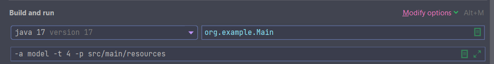

# Block 1

JSON parser which calculates attribute statistics based on .json files and attribute specified. Supports
multithreading execution.


## Running

You can execute program by specifying CLI arguments:

* `-a` or `--attr` means attribute to be calculated statistics on;
* `-t` or `--threads` means amount of threads to be used by thread pool;
* `-p` or `--path means` directory path with .json files to be processed.

Basically, you can specify CLI arguments and run Main class via `Intellij Idea`:

```
-a model -t 4 -p src/main/resources
```



To run application unit tests, following command must be executed:

```
mvn test
```

## Workflow
Car is main entity in this application, therefore, JSON file must be following:

```javascript
[
    {
        "model": "Prius",
        "car_manufacturer": "Toyota",
        "year_manufactured": 1997,
        "color": "blue",
        "car_types": "Sport, Sedan"
    },
    {
        "model": "Model 3",
        "car_manufacturer": "Tesla",
        "year_manufactured": 2017,
        "color": "red",
        "car_types": "Electric, Sedan"
    },
    {
        "model": "Civic",
        "car_manufacturer": "Honda",
        "year_manufactured": 1972,
        "color": "green",
        "car_types": "Sedan"
    },
    {
        "model": "Mustang",
        "car_manufacturer": "Ford",
        "year_manufactured": 1964,
        "color": "yellow",
        "car_types": "Muscle, Coupe"
    },
    {
        "model": "Mustang",
        "car_manufacturer": "Ford",
        "year_manufactured": 1964,
        "color": "yellow",
        "car_types": "Muscle, Coupe"
    },
    {
        "model": "Prius",
        "car_manufacturer": "Toyota",
        "year_manufactured": 1997,
        "color": "blue",
        "car_types": "Sport, Sedan"
    },
    {
        "model": "Prius",
        "car_manufacturer": "Toyota",
        "year_manufactured": 1997,
        "color": "blue",
        "car_types": "Sport, Sedan"
    }
]
```
Field with enumeration/several values/categories in it (`car_types` in my implementation)
is represented by string value with values separated by comma. Json converter is implemented
to check this condition while parsing.

* JSON file must be array of objects
* null values are ignored (program just avoid them without throwing exception)

Application processes all .json files in specified directory, and generates XML file.

For the example above (`model` attribute), XML file will have the following name:
```
statistics_by_model.xml
```

And its content:

```xml
<statistics>
  <item>
    <value>Prius</value>
    <count>3</count>
  </item>
  <item>
    <value>Mustang</value>
    <count>2</count>
  </item>
  <item>
    <value>Model 3</value>
    <count>1</count>
  </item>
  <item>
    <value>Civic</value>
    <count>1</count>
  </item>
</statistics>
```

## Threads benchmark

`CarStatisticsApplicationSpeedTest` class was implemented to test application time spent
 on full program workflow (JSON -> statistics -> XML).

1. __8__ JSON files were written with __1_000_000__ `Car` objects.
2. Amount of threads: __1__, __2__, __4__ and __8__
3. Attribute for testing: `model`

### Results
| Number of Threads | Spent Time (in ms) |
|-------------------|--------------------|
| 1                 | 15390 ms           |
| 2                 | 8701 ms            |
| 4                 | 5776 ms            |
| 8                 | 5227               |
| Attribute         | `Model`            |
| Objects amount    | 1_000_000          |

The test was carried out on the processor __AMD Ryzen 5 4500U__, so depending on CPU
architecture, results may change.
Finally, depending on objects amount, the gap can either increase or decrease.

You can run test on your local machine by running earlier mentioned class `CarStatisticsApplicationSpeedTest`,
which allows to configure all parameters.
